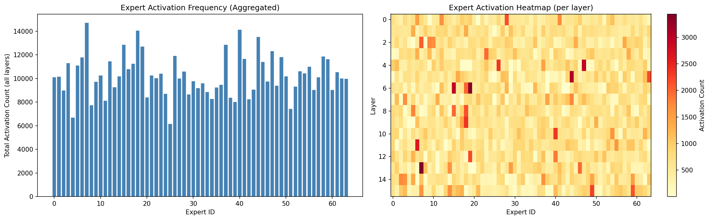
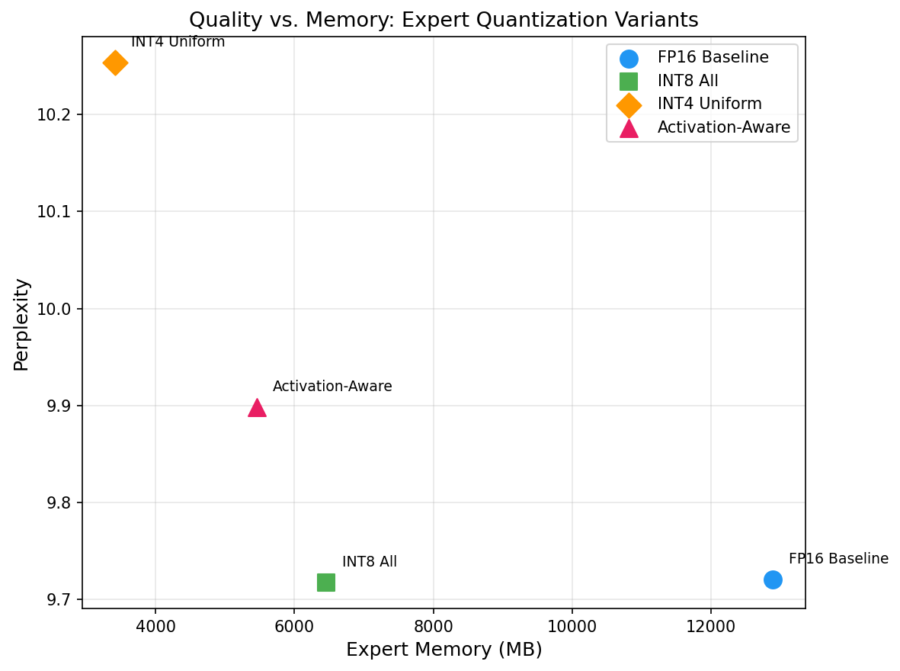

# MoE Expert Quantization Study

Activation-aware weight quantization for Mixture-of-Experts language models. This project profiles expert activation frequencies in OLMoE-1B-7B and tests whether allocating quantization precision based on usage patterns (hot experts at INT8, cold experts at INT4) preserves more quality than uniform quantization. All quantization is implemented from scratch using PyTorch — no external quantization libraries.

## How to Run

Designed for Google Colab (free tier T4 GPU). Run each phase in order:

```bash
pip install torch transformers datasets matplotlib numpy tqdm

python scripts/00_go_no_go.py        # Verify model loads and router logits work
python scripts/01_baseline.py        # FP16 perplexity + memory baseline
python scripts/02_profile_experts.py # Profile expert activation frequencies
python scripts/03_quantize.py        # INT8, INT4, and activation-aware quantization
python scripts/04_results.py         # Generate comparison table + plots
```

Or open `notebooks/colab_runner.ipynb` and run all cells.

## Results

| Variant | Perplexity | Expert Memory (GB) | Delta PPL | Memory Savings |
|---|---|---|---|---|
| FP16 Baseline | 9.7206 | 12.88 | -- | -- |
| INT8 All Experts | 9.7173 | 6.46 | -0.003 | 49.9% |
| INT4 Uniform | 10.2540 | 3.42 | +0.534 | 73.4% |
| Activation-Aware | 9.8985 | 5.46 | +0.178 | 57.6% |

### Expert Activation Frequency



### Quality vs. Memory



## What I Found

INT8 quantization of expert FFN weights is effectively lossless — perplexity is unchanged while halving expert memory. Uniform INT4 compresses 4x but costs 0.53 perplexity points. The activation-aware approach cuts this degradation by two-thirds (to 0.18 points) by keeping frequently-used "hot" experts at INT8 and only compressing rarely-used "cold" experts to INT4. Expert activation frequencies are highly non-uniform: a small subset of experts handles most tokens, which is exactly why differential precision allocation works. The takeaway is that profiling expert usage before quantizing is a low-cost way to get better quality-per-byte in MoE models.